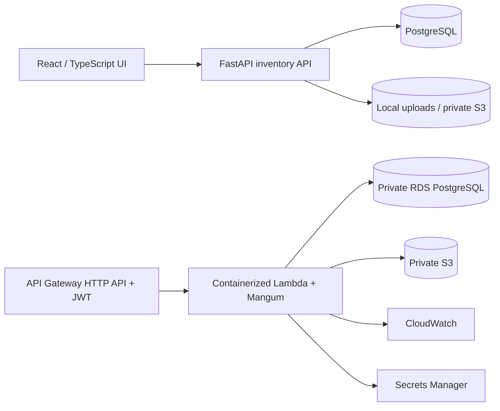

# InfraStock — Cloud Infrastructure Inventory Management

An end-to-end **portfolio demonstration** of a data-center-parts inventory system, built to demonstrate requirements analysis, API design, cloud architecture, security boundaries, and operational tradeoffs for an entry-level AWS Solutions Architect interview.

> **Status:** Local application and AWS Terraform *deployment blueprint*. No AWS account, domain, Cognito provider, or hosted deployment is included. Do not describe the AWS stack as deployed until you personally provision and verify it. All sample vendors, sites, and components are fictional.

## What it does

- Uploads synthetic CSV inventory for data center sites, validating all rows before writes.
- Stores original uploads by SHA-256 digest (local Docker volume or private S3 on AWS).
- Upserts parts identified by `(sku, site)` in PostgreSQL; repeat identical uploads are idempotent.
- Searches by SKU, filters by site and low-stock status, and paginates inventory.
- Shows per-site inventory totals, estimated value, and reorder alerts.
- Exports a low-stock CSV with spreadsheet-formula escaping.

**Scope:** Single-tenant portfolio demonstration, not a procurement or financial-reporting system. Imports are inventory snapshots, not a stock-movement ledger. See [limitations](docs/operations.md).

## Architecture



In local mode the React UI connects to a Dockerized FastAPI service and PostgreSQL. The Terraform blueprint runs the same backend as a Lambda container behind JWT-protected API Gateway routes. The Terraform configuration does **not** provision hosted frontend authentication or web hosting.

**Stack:** Python 3.12, FastAPI, SQLAlchemy, PostgreSQL, React 18, TypeScript, Docker Compose, AWS Lambda, API Gateway, ECR, RDS, S3, IAM, Secrets Manager, CloudWatch, and Terraform.

## Start locally

Requires Docker Desktop / Docker Engine with Compose; no AWS account or AWS credentials are needed to run the local demo.

```bash
cp .env.example .env
# Replace API_KEY in .env with your own local development key.
docker compose up --build
```

Open **http://localhost:5173**, enter the local `API_KEY` from `.env`, and import `sample-data/inventory.csv`. The inventory dashboard will show site distribution, totals, and low-stock alerts. FastAPI's interactive local API documentation is at **http://localhost:8000/docs**.

```bash
docker compose down
# Optional: delete local database and uploaded files permanently:
docker compose down -v
```

The UI/API bind to `127.0.0.1` in local development. PostgreSQL is accessible only within the Compose network.

## Tests and frontend build

```bash
cd backend
python -m pip install -r requirements-dev.txt
python -m pytest -q
cd ../frontend
npm install
npm run build
```

The GitHub Actions workflow runs the backend test suite and frontend build. It does not deploy AWS resources.

## Example API requests

```bash
export API_KEY='replace-with-your-local-key'
curl -H "X-API-Key: $API_KEY" http://localhost:8000/api/parts
curl -H "X-API-Key: $API_KEY" -F "file=@sample-data/inventory.csv" \
  http://localhost:8000/api/inventory/imports
curl -H "X-API-Key: $API_KEY" http://localhost:8000/api/reports/summary
curl -H "X-API-Key: $API_KEY" -o low-stock.csv \
  http://localhost:8000/api/reports/low-stock.csv
```

## Repository layout

```text
backend/                  FastAPI, database models, imports, tests, storage adapter
frontend/                 React / TypeScript dashboard
infra/                    AWS Terraform deployment blueprint
docs/                     Architecture, API, security, deployment, operations, demo
sample-data/              Synthetic infrastructure inventory CSV
.github/workflows/         Backend tests and frontend build
```

## Technical documentation

- [API contract](docs/api.md)
- [Architecture and design decisions](docs/architecture.md)
- [Security and threat model](docs/security.md)
- [AWS deployment instructions](docs/deployment.md)
- [Operations, cost, and limitations](docs/operations.md)
- [Interview demonstration walkthrough](docs/demo.md)
- [GitHub publishing and updates](docs/publishing.md)

## AWS Solutions Architect interview discussion

Explain why `(sku, site)` is the unique key, why PostgreSQL stores queryable inventory while S3 retains content-addressed input files, how duplicate-file detection works, and why the cloud blueprint separates API Gateway authentication, private RDS networking, IAM permissions, and secret management. Discuss NAT/RDS ongoing costs, availability tradeoffs, unimplemented hosted sign-in, and migration options for larger workloads.

**Verification:** Demonstrate valid imports, duplicate no-ops, rejected invalid files, search, low-stock exports, and automated test results. Show AWS resource configuration or performance only after personally provisioning and verifying the deployment.

No real Meta data or company documentation is used in this project.
