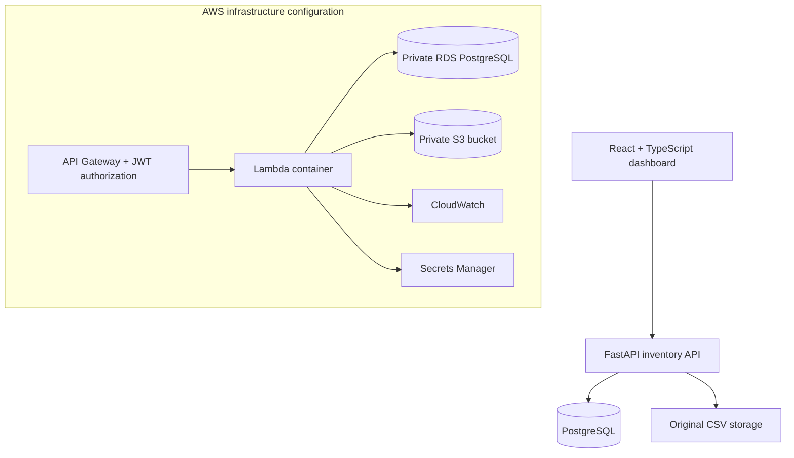

# InfraStock | Cloud Infrastructure Inventory Management

InfraStock is a full-stack inventory management application for tracking data center components across sites. It combines validated CSV ingestion, a searchable parts catalog, site-level reporting, and reorder alerts with a containerized application stack and AWS infrastructure configuration.

**Technology:** Python · FastAPI · PostgreSQL · React · TypeScript · Docker · Terraform · AWS

## Features

- **Inventory imports:** Validate CSV files and update inventory by unique SKU/site pair.
- **Idempotent ingestion:** Detect repeated uploads using SHA-256 file hashes.
- **Inventory visibility:** Search parts by SKU, filter by location, and paginate results.
- **Reorder monitoring:** Identify components at or below their site-specific reorder threshold.
- **Reporting:** View inventory quantities and values by site and export low-stock records.
- **Source-file storage:** Save original CSVs to a local volume or an S3 bucket, depending on configuration.

## Architecture



**Local environment:** Docker Compose runs the React frontend, FastAPI backend, and PostgreSQL. Original uploaded files are stored in a named Docker volume.

**AWS configuration:** Terraform defines a containerized Lambda backend behind JWT-protected API Gateway routes, private RDS PostgreSQL, an S3 upload bucket, IAM permissions, VPC networking, and CloudWatch logging. Deployment requires an AWS account, container image, and an existing OIDC identity provider; see the [deployment guide](docs/deployment.md).

## Run locally

Requires Docker with Docker Compose.

```bash
git clone https://github.com/riyaraut3/cloud-infrastructure-inventory.git
cd cloud-infrastructure-inventory
cp .env.example .env
# Set a unique API_KEY in .env
docker compose up --build
```

Open **http://localhost:5173**, enter the API key configured in `.env`, and import `sample-data/inventory.csv`. The local FastAPI documentation is available at **http://localhost:8000/docs**.

To stop the application:

```bash
docker compose down
```

## API

| Method | Endpoint | Description |
|---|---|---|
| `POST` | `/api/inventory/imports` | Validate and import an inventory CSV |
| `GET` | `/api/parts` | Search and filter inventory |
| `GET` | `/api/reports/summary` | Retrieve aggregate metrics and site-level reports |
| `GET` | `/api/reports/low-stock.csv` | Export low-stock items |
| `GET` | `/api/health` | Check API availability |

Local API requests use the `X-API-Key` header. The AWS configuration uses an API Gateway JWT authorizer. See the [API documentation](docs/api.md) for request parameters, CSV format, and response examples.

## Tests and build

```bash
cd backend
python -m pip install -r requirements-dev.txt
python -m pytest -q
cd ../frontend
npm install
npm run build
```

GitHub Actions runs the backend tests and frontend build on each push and pull request.

## Project structure

```text
backend/              FastAPI service, database models, CSV ingestion, tests
frontend/             React + TypeScript dashboard
infra/                AWS Terraform infrastructure
docs/                 Architecture, API, deployment, security, operations
sample-data/          Synthetic inventory CSV
.github/workflows/     Continuous integration
```

## Documentation

- [System architecture and design decisions](docs/architecture.md)
- [API reference](docs/api.md)
- [AWS deployment guide](docs/deployment.md)
- [Security considerations](docs/security.md)
- [Operations and cost considerations](docs/operations.md)
- [Application walkthrough](docs/demo.md)

Sample site identifiers, inventory records, and suppliers are fictional.
