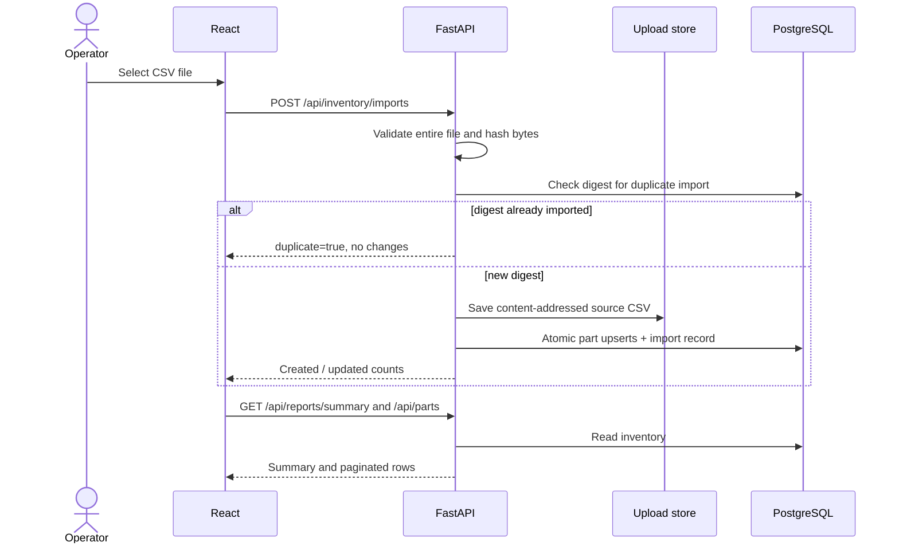

# Architecture and technical decisions

## Functional requirements

A user can import a UTF-8 CSV containing SKU, name, site, supplier, quantity, reorder level, and unit cost; browse inventory with SKU search, site filtering and pagination; see a per-site summary; and download a low-stock report. The same SKU can exist at multiple sites, with different quantities or suppliers. Inventory value is calculated as quantity × unit cost and is illustrative, not financial reporting.

## Decision record 001: Postgres relational source of truth

`parts` has a unique constraint on `(sku, site)`; `imports` has a unique SHA-256. A relational store makes SKU/site upserts and reporting straightforward. An early-stage team can keep this schema simple, while production would likely introduce stock movements, site and supplier tables, schema migration jobs, item-level ownership, and authorization boundaries.

## Decision record 002: S3 for source artifacts

Original CSVs are written under a content-addressed `imports/<sha256>.csv` key, independent of the user-provided filename. The database retains the object key and digest in the import record. In Docker development, an ordinary named volume replaces S3; there is deliberately no MinIO or AWS credential requirement for running locally. A validated file may remain in S3 if a subsequent database transaction fails: production should reconcile orphan objects, use asynchronous ingestion with a durable queue, or use a staged upload state.

## Decision record 003: Idempotent bulk upsert

A repeated byte-identical upload is a no-op. New content applies the entire valid CSV, updating matching `(sku, site)` records and inserting missing ones. Every row is validated before any writes. The import transaction and unique constraint detect concurrent duplicate imports; a 409 response instructs the caller to retry. The importer uses row-level selects and ORM upserts. For larger datasets, a staging table and `INSERT ... ON CONFLICT DO UPDATE` would improve throughput. A changed file *overwrites* current quantities, so this is a snapshot import, not incrementing stock movement.

## Decision record 004: Cloud Lambda and private RDS

The API is containerized for local and Lambda operation. The Lambda image includes Mangum, an ASGI adapter for API Gateway. The Terraform blueprint puts Lambda and RDS in private subnets across two availability zones, with one NAT Gateway for outbound access to S3/Secrets Manager and PostgreSQL connectivity inside the VPC. The single NAT Gateway introduces a single-AZ dependency for outbound connectivity. Production alternatives include VPC service endpoints, highly available NAT, RDS Proxy, and scheduled migration jobs. An early-stage or low-budget prototype might be substantially cheaper with a single small always-on instance and managed Postgres.

## Decision record 005: Narrow trust boundary

Local auth is a developer-chosen `X-API-Key` checked in the FastAPI app. That is unsuitable for a public/browser deployment. In AWS, every route is behind API Gateway's JWT authorizer, and `AUTH_MODE=apigw_jwt` indicates that gateway auth is required. API Gateway is configured to invoke Lambda but there is no Lambda function URL. The blueprint requires the operator to supply an existing OIDC issuer and audience; it does not silently provision public unauthenticated endpoints. The frontend accepts manually supplied bearer tokens; hosted sign-in requires separate identity-provider integration.

## Data movement

## Future enhancements

Potential additions include managed schema migrations with Alembic, Cognito-hosted sign-in, CloudFront/S3 frontend hosting, SQS-based ingestion, RDS Proxy, observability alarms, and structured audit history.
